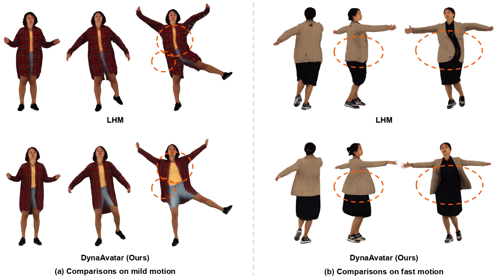

# 💃 DynaAvatar: Zero-Shot Reconstruction of Animatable 3D Avatars with Cloth Dynamics from a Single Image

## CVPR 2026

### [[Project Page]](#) | [[Paper]](#) | [[arXiv]](#) | [[Poster]](#) | [Video](#)

**This is the official PyTorch implementation of the approach described in the following paper:**
> **Zero-Shot Reconstruction of Animatable 3D Avatars with Cloth Dynamics from a Single Image**\
> [Joohyun Kwon*], [Geonhee Sim*], and [Gyeongsik Moon†]\
> IEEE/CVF Conference on Computer Vision and Pattern Recognition (CVPR), 2026

---

## Abstract

Existing single-image 3D human avatar methods primarily rely on rigid joint transformations, limiting their ability to model realistic cloth dynamics. We present DynaAvatar, a zero-shot framework that reconstructs animatable 3D human avatars with motion-dependent cloth dynamics from a single image. Trained on large-scale multi-person motion datasets, DynaAvatar employs a Transformer-based feed-forward architecture that directly predicts dynamic 3D Gaussian deformations without subject-specific optimization. To overcome the scarcity of dynamic captures, we introduce a static-to-dynamic knowledge transfer strategy: a Transformer pretrained on large-scale static captures provides strong geometric and appearance priors, which are efficiently adapted to motion-dependent deformations through lightweight LoRA fine-tuning on dynamic captures. We further propose the DynaFlow loss, an optical flow–guided objective that provides reliable motion-direction geometric cues for cloth dynamics in rendered space. Finally, we reannotate the missing or noisy SMPL-X fittings in existing dynamic capture datasets, as most public dynamic capture datasets contain incomplete or unreliable fittings that are unsuitable for training high-quality 3D avatar reconstruction models. Experiments demonstrate that DynaAvatar produces visually rich and generalizable animations, outperforming prior methods. Code, pretrained models, and reannotations will be released.

---

## TODO
- [x] Release inference code
- [ ] Release train code
- [ ] Release re-annotated datasets

---

## 🚀 Getting Started

### 1. Installation
To set up the environment, please refer to **[INSTALL.md](./INSTALL.md)** for step-by-step instructions.

> [!IMPORTANT]
> We performed the installation using the commands documented in `INSTALL.md`. Please ensure your **Torch** and **CUDA** versions are installed carefully to match your specific hardware environment.

### 2. Model & Data Preparation

Follow these steps to download the required models and configure the project paths.

#### **A. Download prior Models**
Download the LHM prior weights and extract them:
```bash
wget https://virutalbuy-public.oss-cn-hangzhou.aliyuncs.com/share/aigc3d/data/LHM/LHM_prior_model.tar 
tar -xvf LHM_prior_model.tar

# Download pretrained LHM-500M
python download.py
```

#### **B. Update LHM Model Configuration**
Next, you must manually update the configuration file located at:  
`PATH/DynaAvatar_RELEASE/pretrained_models/Damo_XR_Lab/LHM-500M/step_060000/config.json`

Add these fields in the JSON file:
```json
{
    // ...

    "n_history_length": 15,
    "is_dynamic": true
}
```

#### **C. DynaAvatar Checkpoints**
Download the pretrained [DynaAvatar checkpoint](https://drive.google.com/drive/folders/1ypHIxlmAUUDRYIYZUNTTeoW3G84ge8hZ?usp=drive_link) and update the YAML configuration.
* **Config Path**: `PATH/DynaAvatar_RELEASE/configs/inference/human-lrm-500M.yaml`
* **Action**: Update the `saver.load_model` field to point to the absolute path of your downloaded checkpoint.

#### **D. Additional Assets**
* **Example Motion Sequences**: Download the [sample motion sequences](https://drive.google.com/drive/folders/1m7P2ErOKxp3JdcSTDWX2VjFwGTeZ6uhw?usp=drive_link) required for inference.
* **Voxel Grid**: Download the [volume voxel grid](https://drive.google.com/drive/folders/1KvNgPfwdyecUrKKVaowa4-Tdk6gy2m0o?usp=drive_link). Ensure the voxel grid files are placed in:  
  `PATH/DynaAvatar_RELEASE/pretrained_models/volume_voxel_grid`

---

## 💃 Inference 

### Usage Example
Here are two examples using different motion sequences (e.g., DNA-Rendering and 4D-DRESS datasets). 

#### **Example 1: DNA-Rendering sequence**
```bash
CUDA_VISIBLE_DEVICES=0 bash inference.sh LHM-500M \
    /data1/qw00n/DynaAvatar_RELEASE/assets/novel_subject \
    PATH/motion_seqs/DNA_Rendering/0124_03/smplx/smplx_params_smooth \
    None 0 500 15
```

#### **Example 2: 4D-DRESS sequence**
```bash
CUDA_VISIBLE_DEVICES=0 bash inference.sh LHM-500M \
    /data1/qw00n/DynaAvatar_RELEASE/assets/novel_subject \
    PATH/motion_seqs/4D-DRESS/00152_outer_16/smplx/smplx_params_smooth \
    None 0 500 30
```

### Arguments
```bash
bash inference.sh [MODEL_NAME] [SOURCE_IMAGE_DIR] [MOTION_PARAM_PATH] [BG_PATH] [START_FRAME] [MOTION_SIZE] [FPS]
```

* **MODEL_NAME**: Name of the backbone model (e.g., `LHM-500M`).
* **SOURCE_IMAGE_DIR**: Path to the folder containing source images.
* **MOTION_PARAM_PATH**: Path to the SMPL-X motion parameters.
* **MOTION_SIZE**: Maximum number of frames to render (e.g., `300`).
* **FPS**: Frames per second (e.g., `15` or `30`).

### Note
If you encounter VRAM issues, please adjust the `batch_size` in `DynaAvatar_RELEASE/LHM/runners/infer/human_lrm.py` at line 969.

---

## 🤝 Acknowledgement
This work is built upon several amazing open-source projects: [PERSONA](https://github.com/mks0601/PERSONA_RELEASE), [LHM](https://github.com/aigc3d/LHM), and others. We are grateful for their excellent contributions to the community.

---

## 🔗 Citation
If you find our work helpful, please cite:
```bibtex

```